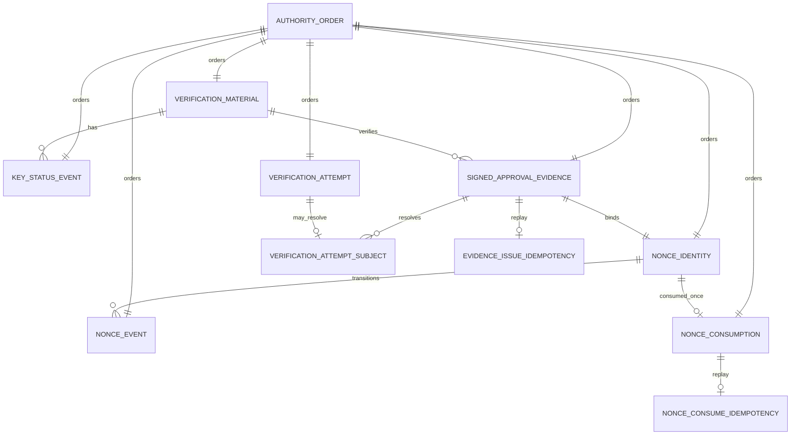

# ADR-0005: Phase 7d Enterprise Local Persistence

- Status: proposed test-only schema evidence; monolithic local-v1 gate and
  migration sequence superseded by ADR-0006
- Scope: local persistence architecture and test-only schema evidence
- Authority effect: none
- Implementation effect: candidate remains an unregistered test fixture and
  verifier; core v16 plus corrective v17 persistence and source-only Phase 7
  behavior through P7-X1 were implemented separately
- Superseded by:
  [ADR-0006](ADR-0006_PHASE_7_LOCAL_V1_TRUST_AND_OPTIONAL_SIGNED_EVIDENCE.md)
  for local-v1 gate tiers, migration 0016/0017 split, and nonblocking
  enterprise follow-up
- Depends on:
  [ADR-0004](ADR-0004_PHASE_7_SIGNED_APPROVAL_EVIDENCE.md),
  [threat model](THREAT_MODEL.md),
  [data model](DATA_MODEL.md),
  [SQLite backup and restore](SQLITE_BACKUP_AND_RESTORE.md), and
  [SQLite retention policy](SQLITE_RETENTION_POLICY.md)

## Decision Summary

The candidate SQL remains useful relational and concurrency design evidence,
but it must not be promoted wholesale as migration 0016. ADR-0006 assigns core
local authorization, nonce, consumption, operation, receipt, reconciliation,
and audit state to now-implemented v16 plus corrective v17. Public-key lifecycle
and signed approval evidence move to optional v18 work. PostgreSQL/HA, fleet, formal
compliance, and contractual RPO/RTO do not block the bounded single-node local
authority loop. Lighter backup/restore, retention, diagnostics, resource,
runbook, update/rollback, data-loss, audit-health, and supported-platform
requirements remain local-v1 blockers.

LNSAT will retain SQLite as the planned authority store for one local process
family on one host, within the measured operating envelope below. This is a
local-first decision, not a claim that SQLite fits every deployment.

PostgreSQL, replication, or high availability becomes a prerequisite before
multi-host writers, automatic failover, durable multi-tenant service, or the
mandatory migration thresholds below. No application-level dual-write bridge
is approved.

This ADR freezes a normalized, relational, append-only logical model for:

- public verification material and status history;
- signed approval evidence;
- nonce identity and lifecycle;
- verification-attempt evidence; and
- candidate-only single-use consumption and nonce-consume-request idempotency
  evidence before any separately authorized runtime implementation.

Core authority state must not use a giant JSON document, nullable-everything
row, wall-clock ordering, mutable current-state row, or application-only
invariant. Database persistence records evidence; it never grants authority.
MCP remains an adapter. `signed_approval.verification_unavailable` and all
current false authority fields remain unchanged.

## Scope And Non-Goals

This decision defines engine fit, relational invariants, transaction boundaries,
query and index requirements, migration controls, recovery objectives,
protection, retention, telemetry, and acceptance tests.

Phase 7d-A1/A2/A3/A4/A5/A6/A7 packets authorize only the inert, unregistered
schema candidate and test verifier described below. They do
not authorize:

- registered SQL migration, runtime store implementation, or new dependency;
- signer, key generation, private material, custody, or signing endpoint;
- nonce generation, operational issuance/cancellation/expiry, or consumption
  implementation;
- operational signed-approval verification;
- execution authorization, adapter dispatch, receipt acceptance, or mutation;
- Gateway, API, MCP, CLI, UI, contract fixture, release, or deployment changes;
  or
- production/customer data, secrets, publication, or destructive Git.

Runtime signing and consumption remain separate approval gates. Key custody
remains governed by ADR-0004 and must be resolved before signing exists.

## Threat And Authority Boundary

The store is inside the Gateway security boundary. It may preserve public
verification material and immutable evidence after higher layers authenticate,
authorize, validate, canonicalize, and bind exact project scope. It must not
infer identity, approval, execution permission, or adapter permission from row
existence.

In-scope failures include:

- process crash, power loss, interrupted write, disk full, and corrupt media;
- concurrent readers, competing local writers, lock timeout, and replay races;
- stale status, key substitution, nonce reuse, idempotency collision, and
  confused-deputy cross-project access;
- migration interruption, binary/schema skew, downgrade, drift, and partial
  restore;
- wall-clock collision or rollback; and
- accidental or in-scope logical tampering.

Host-root compromise remains outside the current threat boundary. A root
attacker can rewrite database bytes and recompute an unkeyed chain. Integrity
checks and digest chaining therefore detect corruption and bounded logical
tampering; they are not remote attestation or root-compromise proof.

## Data Classification

| Class                         | Examples                                                                            | Storage rule                                                   |
| ----------------------------- | ----------------------------------------------------------------------------------- | -------------------------------------------------------------- |
| Public verification data      | Ed25519 public SPKI, key identity/version, activation and status                    | May be stored; never private material                          |
| Controlled authority evidence | canonical signed wrapper, decision references, signature, status and nonce events   | Owner-only local storage, preservation by default              |
| Replay-sensitive identifiers  | nonce digest, idempotency key, request digest                                       | Exact scope binding; never logged in raw operational telemetry |
| Bounded operational metadata  | result code, observed time, resolved local references                               | Minimize and retain under approved policy                      |
| Forbidden                     | private keys, seeds, credentials, bearer or CSRF tokens, raw hostile request bodies | Never stored in this model                                     |

Signed payloads can contain personal or commercially sensitive references even
when signatures are public. Before implementation, privacy/legal review must
approve field minimization, retention, and any pseudonymous reference scheme.

## Existing Store Gap Matrix

Current SQLite schema v17 provides core local authority-loop persistence. It
does not contain this candidate's public-key or signed-evidence model and must
not be treated as runtime authority by persistence alone.

| Control             | Current proof                                                                                                     | Phase 7d gap                                                                                                       |
| ------------------- | ----------------------------------------------------------------------------------------------------------------- | ------------------------------------------------------------------------------------------------------------------ |
| Secure open         | WAL, foreign keys, `synchronous=FULL`, defensive and untrusted-schema posture, bounded busy timeout               | Phase 7d startup health and capacity gates not defined in source                                                   |
| Migration integrity | Seventeen ordered, digest-bound, transactional migrations with drift and rollback tests                           | Current open path may migrate automatically; later authority behavior requires explicit approval and restore point |
| Immutable evidence  | Stable core v17 tables plus packet, policy, approval, nonce, authorization, receipt, audit, and recovery evidence | No runtime signed evidence, public-key status, or operational signature verification                               |
| Atomic replay       | Attempt/nonce/authorization/consumption replay and competing-writer tests                                         | No optional signed-evidence issuance/consume idempotency runtime                                                   |
| Stable ordering     | Existing authority-chain/audit ordering                                                                           | No global Phase 7d order across new record families                                                                |
| Failure behavior    | Transaction rollback, nonce audit/state failure rollback, interrupted migration, and `SQLITE_FULL` tests          | No kill-point matrix for signed issuance or capability consumption                                                 |
| Recovery            | Verified online backup, nonce restart/restore proof, no-clobber inert restore, integrity and foreign-key checks   | No signed-evidence chain recovery, RPO/RTO gate, or activation runbook                                             |
| Retention           | Preserve-only current authority families and bounded read-only planner                                            | No privacy/legal decision for signed payloads or verification attempts                                             |
| Concurrency         | Competing-connection serialization and rollback coverage                                                          | No measured 64-reader/eight-writer Phase 7d load proof                                                             |
| Confidentiality     | Secret references only; local file controls                                                                       | No approved stronger-than-OS encryption/key-custody design                                                         |

## Workload Envelope

SQLite remains eligible only while all of these are true:

| Dimension        | Supported envelope                                                                                                      |
| ---------------- | ----------------------------------------------------------------------------------------------------------------------- |
| Topology         | One host, local filesystem, one LNSAT process family; no network filesystem                                             |
| Database size    | At most 20 GiB and 10,000,000 total Phase 7d core/event rows                                                            |
| Growth           | At most 2 GiB per day                                                                                                   |
| Writes           | At most 25 committed writes/second sustained for 30 minutes; 100/second burst for 60 seconds                            |
| Readers          | At most 64 concurrent read transactions                                                                                 |
| Writers          | One active SQLite writer and at most eight queued application writers                                                   |
| Latency          | write commit p95 at most 50 ms, p99 at most 200 ms; transaction wall time at most 500 ms                                |
| Locking          | 5-second SQLite busy timeout; busy/locked failures below 0.1% of writes                                                 |
| Offline duration | 30 days without a network service, subject to local backup media and capacity                                           |
| Volume           | At least 64 GiB dedicated capacity; at least the greater of 5 GiB or 20% free                                           |
| Recovery         | target RPO at most one hour or 10,000 committed global sequences, whichever occurs first; target RTO at most four hours |

SQLite supports serializable transactions by serializing writers; WAL permits
readers alongside a writer but still has one writer at a time. WAL also assumes
all participants are on one host. These properties fit the bounded local
workload, not a fleet service. See official SQLite
[isolation](https://www.sqlite.org/isolation.html),
[WAL](https://www.sqlite.org/wal.html), and
[appropriate-use](https://www.sqlite.org/whentouse.html) guidance.

### Capacity And Engine Gates

Capacity alerts fire at 70%, 80%, and 90% of every size, growth, concurrency,
queue, latency, and write-rate limit. Crossing an envelope limit blocks scope
growth and requires a measured engine review.

PostgreSQL or another client/server design is mandatory before any of:

- writer access from more than one host;
- automatic failover, synchronous replication, fleet service, or durable
  tenant isolation;
- RPO below one hour or RTO below four hours;
- more than 50 writes/second sustained for 15 minutes or 200 writes/second
  burst;
- busy/locked failures at or above 0.1% or writer-wait p95 above 50 ms in two
  consecutive 15-minute windows;
- database size above 20 GiB or growth above 2 GiB/day;
- verified backup longer than 30 minutes or restore drill longer than four
  hours.

PostgreSQL is comparison target because its MVCC and streaming/log-shipping
facilities address concurrent service and HA needs. A future decision must
define topology, failover consistency, replication lag, tenant isolation,
backup, and cutover; this ADR does not approve that system. See official
PostgreSQL [concurrency](https://www.postgresql.org/docs/current/mvcc-intro.html),
[high availability](https://www.postgresql.org/docs/current/high-availability.html),
and [backup](https://www.postgresql.org/docs/current/backup.html) documentation.

## Logical Model

Names below are normative logical names. A future migration may adapt physical
naming only if every invariant remains database-enforced and traceable.

Every core table is `STRICT`. Foreign keys are enabled and verified on every
connection. All identifiers and enums are bounded canonical text, all digests
are exact 32-byte blobs, and all persisted booleans use constrained integer
values. Deletion uses `ON DELETE RESTRICT`; preservation is default.

### `authority_order`

Purpose: collision-free order and tamper-evident linkage across Phase 7d
authority families.

- `sequence`: non-null `INTEGER PRIMARY KEY AUTOINCREMENT`.
- `record_family`, `record_id`: non-null; unique pair.
- `content_digest`, `chain_digest`: non-null 32-byte blobs.
- `prior_chain_digest`: nullable only for `sequence = 1`; otherwise exact
  preceding `chain_digest`.
- `committed_at`: non-null canonical UTC timestamp for evidence, never order.

`AUTOINCREMENT` prevents reuse of prior rowids; gaps are valid. Order is
`sequence`, never timestamp. See SQLite
[AUTOINCREMENT](https://www.sqlite.org/autoinc.html) behavior.
Database triggers require each owning row to match its order row's family and
record identity. The single store boundary rederives content digests and the
chain before insert and after read; immutable rows prevent later divergence.
Order rows remain immutable even if an approved retention policy later removes
eligible operational detail.

### `verification_material`

Purpose: immutable public key version.

- `material_ref`: non-null primary key.
- `key_id`: non-null stable logical key identity.
- `key_version`: non-null positive integer; unique with `key_id`.
- `algorithm`: non-null and exactly `Ed25519`.
- `spki_der`: non-null exact 44-byte RFC 8410 public SPKI; unique.
- `valid_from`, `valid_until`: non-null canonical UTC timestamps with
  `valid_until > valid_from`.
- `supersedes_material_ref`: nullable only for version 1; otherwise non-null
  self-table foreign key to same `key_id` and immediately prior version.
- `authority_sequence`: non-null unique foreign key to `authority_order`.

Composite uniqueness plus a database trigger enforces same-key immediately
prior version for `supersedes_material_ref`. No private or secret bytes are
permitted. Material rows never change.

### `key_status_event`

Purpose: append-only activation, retirement, and compromise revocation history.

- `status_event_id`: non-null primary key.
- `material_ref`: non-null foreign key to `verification_material`.
- `revision`: non-null positive integer; unique with `material_ref`.
- `status`: non-null enum `active`, `retired`, or `revoked`.
- `effective_at`, `recorded_at`: non-null canonical UTC timestamps.
- `reason_code`: non-null bounded enum.
- `prior_status_event_id`: nullable only for revision 1; otherwise non-null
  foreign key to same material and revision minus one.
- `authority_sequence`: non-null unique foreign key to `authority_order`.

Allowed transitions are no status to `active`, `active` to `retired`, and any
non-revoked status to terminal `revoked`. Revision must be consecutive.
Transition triggers compare latest events across the key lineage and permit at
most one currently active material per `key_id`; old `active` history remains
immutable. Operational verification derives current status from the latest
event and rejects expired, not-yet-valid, retired-for-signing, or revoked
material. Historical verification policy remains ADR-0004.

### `nonce_identity` And `nonce_event`

Purpose: immutable nonce identity plus append-only lifecycle.

`nonce_identity`:

- `nonce_id`: non-null primary key in exact
  `nonce_<64 lowercase hex>` form, representing 256 nonce bits.
- `project_ref`, `decision_id`: non-null, unique together, and bound by
  composite foreign key plus trigger to an approved, gate-satisfied,
  non-authorizing approval decision in the same project.
- `nonce_digest`: non-null unique 32-byte SHA-256 digest of the decoded 32
  canonical nonce bytes.
- `issued_at`, `expires_at`: non-null; issue is at or after decision time and
  before decision expiry, while nonce expiry exactly inherits decision expiry.
- `authority_sequence`: non-null unique foreign key to `authority_order`.

`nonce_event`:

- `nonce_event_id`: non-null primary key.
- `nonce_id`: non-null foreign key to `nonce_identity`.
- `revision`: non-null positive integer; unique with `nonce_id`.
- `event_kind`: non-null enum `issued`, `cancelled`, `expired`, or `consumed`.
- `effective_at`, `recorded_at`: non-null canonical UTC timestamps.
- `prior_nonce_event_id`: nullable only for revision 1; otherwise non-null
  foreign key to same nonce and revision minus one.
- `authority_sequence`: non-null unique foreign key to `authority_order`.

Revision 1 must be `issued`; revision 2, when present, must be one of
`cancelled`, `expired`, or future-schema-only `consumed` and must point to
revision 1. Terminal events cannot transition. Expiry is evaluated from
server-owned time and persisted as an event before any future consumption.
A unique partial terminal-event index plus triggers enforces one terminal
outcome under races.

### `signed_approval_evidence`

Purpose: immutable, locally issued signed wrapper after later authorization.

- `evidence_id`: non-null primary key in exact `sae_<64 lowercase hex>` form
  and exactly equal to the hex identity carried by `payload_digest`.
- `project_ref`, `decision_id`: non-null; unique pair.
- `material_ref`: non-null foreign key to `verification_material`.
- `nonce_id`: non-null unique foreign key to `nonce_identity`.
- `canonical_payload`: non-null canonical bytes, at most 1 MiB.
- `payload_digest`: non-null unique 32-byte digest of those exact bytes.
- `signature`: non-null exact 64-byte Ed25519 signature.
- `issued_at`, `expires_at`: non-null and exactly match validated wrapper.
- `approval_gate_satisfied`: non-null constrained boolean that exactly matches
  the nested decision.
- `server_signed`: non-null constrained true; signature authenticity still
  requires the separately authorized cryptographic verification path.
- `execution_authorized`, `session_authority_state_changed`,
  `mutation_authority`: non-null constrained false.
- `authority_sequence`: non-null unique foreign key to `authority_order`.

Normalized project, decision, key, nonce, and time fields are independently
constrained and must match canonical payload values. Canonical bytes remain
stored because exact signature verification requires them. Core authority
fields never hide inside JSON.

Relational identity, size, uniqueness, transition, deletion, and false-authority
rules are database-enforced. Canonical-byte correspondence, content digests,
and signatures are cryptographic invariants: the single store boundary
rederives them before insert and after read, while immutability triggers prevent
later divergence. No alternate write path is allowed.

### `verification_attempt` And `verification_attempt_subject`

Purpose: bounded append-only operational evidence without retaining hostile raw
input.

`verification_attempt` contains only non-null values:

- `attempt_id` primary key, `project_scope_digest`, `input_digest`,
  `result_code`, `reason_code`, `observed_at`, and `authority_sequence`.

`verification_attempt_subject` exists only when input safely resolves:

- `attempt_id`: primary and foreign key to `verification_attempt`.
- `evidence_id`: non-null foreign key to `signed_approval_evidence`.
- `material_ref`: non-null foreign key to `verification_material`.

Absence uses absence of the child row, not nullable subject columns. Raw hostile
input, credentials, tokens, private bytes, and unbounded error strings are
forbidden. Result and reason use bounded enums. Attempts grant no authority.

The Phase 7d-A5 candidate freezes `attempt_id` as `vat_` plus 64 lowercase
hexadecimal characters. `project_scope_digest` is SHA-256 over domain
`lnsat.phase7d.verification-project-scope.v1` plus exact `project_ref`.
`input_digest` is SHA-256 over domain
`lnsat.phase7d.verification-input.v1` plus one bounded exact input byte string;
the bytes are never persisted. `result_code` is exactly `verified` or
`rejected`. Success pairs only with reason `verified`; rejection pairs only
with one exact ADR-0004 `signed_approval.*` error code. The optional subject
uses a composite evidence/material foreign key, and a verified result requires
one subject during test-only verification. The attempt content digest binds
all parent fields plus subject presence and identities under domain
`lnsat.phase7d.verification-attempt.v1`.

The candidate append helper accepts an already closed simulated result; it does
not perform signature or operational chain verification. It uses one immediate
transaction and returns only after authority, attempt, optional subject, and
commit succeed. Injected subject-audit failure returns an error and rolls back
all staged rows. Attempts and subjects are preserve-only in this candidate. No
cleanup path or retention period is authorized; those runtime decisions remain
an approval gate.

### Phase 7d-A6 `nonce_consumption`

Purpose: one durable burn record for a test-only one-winner external-identity
binding before any adapter boundary.

- `consumption_id`: non-null primary key, format `nsc_` + 64 lowercase hex.
- `project_ref`: non-null and must match nonce and evidence.
- `nonce_id`: non-null unique foreign key to `nonce_identity`.
- `evidence_id`: non-null unique foreign key to `signed_approval_evidence`.
- `authorization_ref`: non-null unique safe lowercase external reference.
- `authorization_digest`: non-null 32-byte digest.
- `consumed_at`: non-null canonical UTC timestamp.
- `authority_sequence`: non-null unique foreign key to `authority_order`.

This row proves one-time consumption evidence; it does not execute an action,
accept a receipt, or grant adapter authority.

The A6 candidate derives `authorization_digest` over domain
`lnsat.phase7d.authorization-bundle.v1` plus one exact bounded authorization
byte string. Raw authorization bytes are not persisted. This is identity
binding only; the candidate does not validate an operational authorization
bundle or grant execution authority.

### Idempotency

`evidence_issue_idempotency` and Phase 7d-A7 `nonce_consume_idempotency` each
use:

- composite primary key `(project_ref, idempotency_key)`;
- non-null exact 32-byte `request_digest`;
- one non-null unique result foreign key to its owned evidence or consumption
  row; and
- non-null `created_at`.

Operation families use separate tables, so keys cannot cross authority
operations. Project is part of every lookup and equality check. Exact same key,
project, and request digest returns the committed result without writing.
Different digest with same scoped key is a deterministic conflict. Same
decision or nonce under another idempotency key returns the original identity
only after exact request comparison; otherwise it conflicts. Cross-project
reuse cannot observe or claim another project's row.

The Phase 7d-A4 candidate freezes only evidence issuance. Its idempotency key
uses the existing exact `idem_` identifier grammar. Request identity is
SHA-256 over domain `lnsat.phase7d.evidence-issue-request.v1`, exact
`project_ref`, and exact `approval_decision_id`, using the candidate encoding
below. Generated nonce, key selection, signature, and evidence result are not
request inputs. This permits request comparison before nonce generation or
signing without making a result-dependent request digest. No public resolver
or runtime issuance path is authorized.

The Phase 7d-A7 candidate freezes only test-only nonce consumption replay. Its
request identity is SHA-256 over domain
`lnsat.phase7d.nonce-consume-request.v1`, exact `project_ref`, `nonce_id`,
`evidence_id`, `authorization_ref`, and the 32-byte `authorization_digest`
already derived under `lnsat.phase7d.authorization-bundle.v1`.
`consumption_id`, `consumed_at`, `created_at`, authority order, material/status
resolution, and terminal-event identity are result or server-derived values,
not request inputs. Exact replay is checked before current nonce state so a
committed result remains readable after the nonce becomes terminal. No public
resolver or runtime consumption path is authorized.

### Extension Evidence

Core identity, relationships, status, authority, ordering, and query fields are
normalized. A bounded extension-evidence column is allowed only when a reviewed
external requirement cannot be represented without losing evidence. It must:

- be canonical, versioned JSON with a non-null schema identifier and SHA-256;
- be at most 16 KiB;
- contain no authority-bearing field, secret, token, private material, or raw
  hostile input; and
- have explicit compatibility, retention, and validation tests.

Unversioned or unbounded JSON is rejected.

## Query And Index Matrix

| Path                     | Predicate/order                               | Required index or constraint                               | Plan acceptance            |
| ------------------------ | --------------------------------------------- | ---------------------------------------------------------- | -------------------------- |
| Resolve key version      | `key_id`, `key_version`                       | unique material key/version                                | one-row unique search      |
| Resolve active status    | `material_ref`, revision descending           | unique material/revision plus latest-state/lineage indexes | indexed latest-row lookup  |
| Fetch signed evidence    | `project_ref`, `decision_id`                  | unique project/decision                                    | one-row unique search      |
| Resolve nonce            | `nonce_digest` or project/decision            | unique nonce digest and project/decision                   | one-row unique search      |
| Get nonce state          | `nonce_id`, revision descending               | unique nonce/revision                                      | indexed latest-row lookup  |
| Exact issuance replay    | project/idempotency key                       | composite primary key                                      | one-row primary-key search |
| Exact consumption replay | project/idempotency key                       | composite primary key                                      | one-row primary-key search |
| Attempt timeline         | project-scope digest, observed time, sequence | composite scope/time/sequence index                        | bounded range scan         |
| Capacity/retention batch | table order/sequence with limit               | primary or explicit sequence index                         | bounded forward range scan |
| Verify chain             | sequence range                                | `authority_order` primary key                              | ordered range scan         |

Implementation tests must pin representative `EXPLAIN QUERY PLAN` shapes and
row-count fixtures. Request paths may not add an unbounded full scan. Plan
checks are regression signals, not a substitute for measured latency. SQLite's
[query planner](https://www.sqlite.org/queryplanner.html) and
[`EXPLAIN QUERY PLAN`](https://www.sqlite.org/eqp.html) documentation define the
inspection basis.

## Transaction And Crash Model

Every mutation starts with `BEGIN IMMEDIATE`, acquiring the single writer slot
before reading mutable authority state. All connections keep foreign keys on,
WAL mode, `synchronous=FULL`, defensive mode, untrusted schema, and the bounded
busy timeout. SQLite documents transaction behavior in
[transaction control](https://www.sqlite.org/lang_transaction.html) and
[atomic commit](https://www.sqlite.org/atomiccommit.html); the Rust wrapper must
use explicit `rusqlite`
[`TransactionBehavior`](https://docs.rs/rusqlite/latest/rusqlite/enum.TransactionBehavior.html).

Logical lock/access order is:

1. scoped idempotency identity;
2. public material and latest status;
3. nonce identity and latest lifecycle event;
4. global authority sequence and owned evidence rows;
5. idempotency result row.

Issuance is one transaction: rederive and revalidate complete decision chain,
reserve exact identities, read active status, create bounded nonce, build
canonical preimage, invoke a later approved local signer under a hard timeout,
locally verify returned signature, insert order/evidence/nonce/issued-event and
idempotency rows, then commit. Signer code cannot query or mutate the database.
No signature or response escapes before commit. Failure or crash leaves zero
rows and no externally visible issuance.

Holding the writer during signing is accepted only while total transaction time
stays at or below 500 ms. If custody cannot satisfy that bound, ADR-0004 and
this ADR must be amended before any multi-transaction intent protocol is
considered.

Key rotation retires old material and activates its successor in one
transaction. Verification uses one read snapshot for material, history,
evidence, and nonce state, then appends its bounded attempt in a separate
immediate transaction; operational success is not returned if required audit
append fails.

Phase 7d-A6 candidate consumption uses one immediate transaction to rederive
project, evidence, key-status, expiry, and latest nonce state, derive the exact
authorization digest, then insert the unique consumption, adjacent terminal
consumed nonce event, and order rows before commit. Phase 7d-A7 adds scoped
consume-request idempotency to that same sequence. The immediate transaction
first resolves exact committed replay or scoped conflict. For a new request it
inserts consumption, adjacent terminal event, authority rows, and one
`project_ref`/`idempotency_key` result before commit. Adapter dispatch remains
later and outside this ADR. No database retry may change canonical request
identity.

Any constraint, timeout, disk, signer, verification, audit, or commit failure
rolls back. Callers receive one closed result with no partial identifiers or
authority. Automatic retry is allowed only for the exact same scoped
idempotency request.

## Schema Change And Compatibility

Future authority schema changes use ordered, immutable, digest-bound forward
migrations. The supported path is exactly one known version at a time unless a
separate release explicitly proves more. A binary seeing a future or unknown
version fails before any write. Drift, changed migration digest, unknown
object, failed invariant, or downgrade attempt fails closed. There is no silent
repair, implicit fallback store, destructive downgrade, or reverse DDL.

Unlike current local-foundation startup, Phase 7d authority migration requires:

1. read-only inspect and compatibility report;
2. fresh verified backup and recorded SHA-256;
3. explicit operator approval for the exact source/target versions and binary;
4. one atomic `BEGIN IMMEDIATE` forward migration;
5. post-migration schema, migration-digest, `integrity_check`,
   `foreign_key_check`, and authority-chain verification; and
6. explicit activation only after all checks pass.

Interruption must leave either old committed schema or new committed schema,
never a mixed version. Recovery restores the verified pre-change backup to a
fresh inert path. It never overwrites or automatically activates live data.
SQLite notes that
[`integrity_check`](https://www.sqlite.org/pragma.html#pragma_integrity_check)
does not find foreign-key errors, so both checks are mandatory.

## Backup, Restore, And Disaster Recovery

Backups use SQLite's online backup API to a fresh no-clobber file while writes
continue. Artifact and parent-directory durability are flushed; directory mode
is `0700`, database/WAL/SHM/backup mode is `0600`, ownership is verified, and
symlink, hardlink, network-filesystem, and unsafe-parent targets are refused.
Official [SQLite backup API](https://www.sqlite.org/backup.html) semantics are
the base.

Every backup records source schema version, migration digests, sequence range,
row counts, byte size, creation time, and SHA-256. Verification runs schema
checks, `integrity_check`, `foreign_key_check`, authority-chain recomputation,
and bounded semantic invariants against the standalone copy.

Target cadence is at least hourly or every 10,000 committed global sequences,
whichever occurs first. Missing that target is an RPO health breach and pages
the operator. Issuance must hard-stop after 24 hours or 100,000 sequences
without a verified backup. Production eligibility requires an approved
off-host encrypted copy process; encryption keys remain outside LNSAT and are
never stored in this schema.

Restore is quarterly-tested into a fresh inert path. Drill acceptance is:

- latest eligible backup discovered without trusting filename alone;
- checksum, ownership, permissions, schema, migrations, integrity, foreign
  keys, chain, row counts, and semantic invariants verified;
- bounded evidence readback and exact replay tests pass;
- RPO target is measured and RTO stays at or below four hours; and
- activation remains a separate, explicit, audited operator action.

NIST contingency-planning guidance motivates tested restoration and recovery
objectives; see [SP 800-34 Rev. 1](https://csrc.nist.gov/pubs/sp/800/34/r1/final).

## Storage Protection And Key Separation

Core SQLite is not application-encrypted. Required baseline is host full-disk
or file-volume encryption, owner-only directory/file permissions, local
filesystem, least-privilege service identity, protected backup transport, and
encrypted off-host backup. Secrets remain references only.

If threat review requires confidentiality against offline media access without
OS protection, implementation is blocked pending a separate encryption and key
custody ADR. That decision must select a supported SQLite encryption mechanism
or different engine, define key generation/rotation/recovery, prove crash and
backup behavior, and keep encryption keys outside the database. It cannot be
solved with ad hoc field encryption.

NIST [SP 800-57 Part 1 Rev. 5](https://csrc.nist.gov/pubs/sp/800/57/pt1/r5/final)
governs later key-management design. OWASP
[Cryptographic Storage](https://cheatsheetseries.owasp.org/cheatsheets/Cryptographic_Storage_Cheat_Sheet.html)
and [Database Security](https://cheatsheetseries.owasp.org/cheatsheets/Database_Security_Cheat_Sheet.html)
are secondary implementation checklists.

## Retention, Privacy, And Growth

Verification material, status history, signed evidence, nonce identity/events,
consumption, authority order, and idempotency evidence are preserve-only by
default. Verification attempts are the only initially eligible cleanup family,
and only under a separately approved, versioned policy with legal hold,
reference safety, a bounded plan, and audited batch deletion.

Signed canonical payload cannot be selectively erased without invalidating its
signature and digest. If approved privacy requirements demand deletion,
implementation is blocked until design uses approved pseudonymous references,
whole-record legal deletion with preserved tombstone evidence, or approved
crypto-erasure. This ADR chooses none.

Capacity planning measures database, WAL, backup, table, index, and daily
growth bytes. Cleanup never deletes authority evidence to recover disk space.
At 90% capacity, nonessential attempt recording may fail closed according to
future policy, but issuance and consumption may not silently discard required
audit evidence.

## Tamper Detection And Fail-Closed Startup

Startup verifies:

- exact schema version and every migration digest;
- expected tables, columns, indexes, triggers, and `STRICT` posture;
- `integrity_check` and `foreign_key_check`;
- global authority-chain linkage and content digests;
- latest status and nonce-event transition invariants; and
- no duplicate semantic identity or impossible terminal state.

Full checks may run at operator-approved startup/maintenance intervals; bounded
incremental checks run on every open and affected read. Any mismatch opens
read-only recovery inspection only. Signing, verification success, nonce
transition, consumption, and adapter use remain unavailable. No repair occurs
automatically.

## Telemetry, Health, And Runbooks

Metrics contain counts and timings, not raw payload, nonce, idempotency key,
signature, token, or personal data:

- database/WAL/backup bytes, free bytes, growth rate, row counts;
- write rate, queue depth, writer wait, commit latency, busy/locked/rollback
  counts, checkpoint duration, and oldest read snapshot age;
- schema version, migration phase/result, integrity/foreign-key/chain result;
- backup age, sequence lag, duration, verification result, restore-drill age
  and RPO/RTO;
- status/nonce transition rejection, replay, collision, audit-append failure,
  and capacity threshold counts.

Health is `ready`, `degraded`, or `blocked`. Unknown schema, failed invariant,
integrity/foreign-key/chain failure, unsafe permissions, full disk, or expired
hard backup gate is `blocked` for authority mutations. Alerts use the 70/80/90
capacity levels and exact engine gates.

Before implementation, operator runbooks must cover lock contention, long
reader/checkpoint pressure, disk-full recovery, corrupt database, failed
migration, binary downgrade, backup breach, inert restore inspection,
activation, key compromise, and migration-to-service escalation. Audit design
follows NIST [SP 800-92](https://csrc.nist.gov/pubs/sp/800/92/final) and security
controls are mapped during implementation to
[SP 800-53 Rev. 5](https://csrc.nist.gov/pubs/sp/800/53/r5/upd1/final).

## Acceptance Test Matrix

| Area                  | Required proof before implementation can be called authority-grade                                                                          |
| --------------------- | ------------------------------------------------------------------------------------------------------------------------------------------- |
| Relational invariants | direct SQL attempts cannot violate every PK, FK, unique, check, transition, nullability, size, and deletion rule                            |
| Ordering              | 10,000 cross-family commits sharing the same timestamp still have unique monotonic sequence and valid chain                                 |
| Concurrency           | 64 readers plus eight queued writers remain inside latency/error envelope; long-reader checkpoint pressure is bounded                       |
| Races                 | 32-way issuance, idempotency, status rotation, expiry, cancellation, and consumption races yield exactly one legal winner                   |
| Replay/isolation      | exact replay is read-only; changed digest conflicts; cross-project and cross-operation confused-deputy attempts reveal no foreign result    |
| Crash atomicity       | process kill and power-loss simulation at every transaction boundary yields all-or-zero state after reopen                                  |
| Capacity              | `SQLITE_FULL`, quota, WAL growth, and 5-second busy timeout produce rollback and closed result with no partial authority                    |
| Corruption/tamper     | page corruption, deleted/changed rows, chain rewrite, invalid transition, FK break, and migration drift block authority startup             |
| Migration             | fresh, each supported prior version, interruption at every step, digest mismatch, future version, downgrade, and restore recovery           |
| Backup/restore        | concurrent-WAL backup, no-clobber, permissions, fsync evidence, checksum, semantic verification, quarterly inert restore, RPO/RTO           |
| Query plans           | representative maximum-size fixtures use required indexes; no unbounded request-path scan; latency remains inside envelope                  |
| Time                  | identical timestamps, backward wall clock, expiry boundary, and monotonic-duration timeout cannot change stable order or revive state       |
| Security              | forbidden-field injection, oversized JSON/payload, symlink/hardlink, unsafe permissions, raw hostile input, and private-material scans fail |
| Retention             | preservation families never plan deletion; attempt cleanup respects hold, reference, batch, audit, and disk-pressure rules                  |
| Observability         | metrics redact sensitive values; every degraded/blocked gate and migration/backup phase is deterministic and tested                         |

Tests must cover both repository-native logic and real SQLite behavior using the
pinned Rust toolchain and supported OS filesystems. SQLite foreign keys are
enabled per connection and tested because the engine does not enable them by
default; see official [foreign-key](https://www.sqlite.org/foreignkeys.html)
guidance. Type enforcement uses
[`STRICT` tables](https://www.sqlite.org/stricttables.html).

## Phase 7d-A1/A2/A3/A4/A5/A6/A7 Candidate Evidence

Phase 7d-A1 checks in one inert SQL fixture at
`crates/lnsat-store/tests/fixtures/phase7d_public_material_schema_candidate.sql`.
Phase 7d-A2 extends that same fixture. Candidate schema version 16 now covers
`authority_order`, public verification material, append-only key-status
history, nonce identity, and append-only nonce lifecycle. Phase 7d-A3 extends
the same fixture with one immutable `signed_approval_evidence` relation. It binds
one approved project decision and issued nonce to active public material, bounded
canonical payload bytes, the exact frozen preimage SHA-256 digest and matching
`sae_` identity, one 64-byte structural signature, inherited times, and fixed
gate/server-signing/non-authority fields. The fixture is included only inside the
Rust `#[cfg(test)]` module. Phase 7d-A4 adds one immutable
`evidence_issue_idempotency` relation with a composite project/key primary key,
exact 32-byte request digest, unique project-bound evidence result, and canonical
creation time. Phase 7d-A5 adds immutable, preserve-only `verification_attempt`
and optional `verification_attempt_subject` relations. They bind canonical attempt
identity, project-scope/input digests, one closed result/reason pair, trusted
observation time, optional safely resolved evidence/material identity, and
authority-chain ownership without storing raw input. Phase 7d-A6 adds one
immutable, preserve-only `nonce_consumption` relation. It binds one safe
external authorization reference and non-authorizing digest, one `nsc_`
consumption identity, consumed timestamp, and exactly one adjacent terminal
nonce `consumed` event per nonce.
Phase 7d-A7 adds one preserve-only request-idempotency row for
`project_ref` + `idempotency_key`. It binds exact 32-byte request digest, a
unique consumption result, and canonical `created_at`. The request digest uses
`lnsat.phase7d.nonce-consume-request.v1` and binds exact project, nonce,
evidence, authorization reference, and authorization digest. Raw authorization
bytes are not stored.

The checked-in public signature fixture is structural source evidence only. It
is not a valid signature over the LNSAT preimage and makes no cryptographic,
signing, verification, or runtime authenticity claim.

Runtime schema version and registered migration array are both 17, with core
`0016_phase7_core_persistence` and corrective
`0017_phase7_preauthorization_hardening` registered. Candidate schema is
test-only v18; normal store open rejects a manually candidate-upgraded database
as a future unsupported schema. No public store method reads or writes
candidate public-key or signed-evidence tables.

Candidate content, request, and chain verification uses SHA-256 with these
exact domains:

- `lnsat.phase7d.verification-material.v1`;
- `lnsat.phase7d.key-status-event.v1`;
- `lnsat.phase7d.nonce-identity.v1`;
- `lnsat.phase7d.nonce-event.v1`;
- `lnsat.phase7d.signed-approval-evidence.v1`;
- `lnsat.phase7d.evidence-issue-request.v1`;
- `lnsat.phase7d.verification-project-scope.v1`;
- `lnsat.phase7d.verification-input.v1`;
- `lnsat.phase7d.verification-attempt.v1`;
- `lnsat.phase7d.authorization-bundle.v1`;
- `lnsat.phase7d.nonce-consume-request.v1`;
- `lnsat.phase7d.nonce-consumption.v1`; and
- `lnsat.phase7d.authority-chain.v1`.

Each domain is UTF-8 followed by NUL. Text and blobs use unsigned 32-bit
big-endian length prefixes, positive integers use unsigned 64-bit big-endian
encoding, and nullable values use a one-byte presence tag. Material, status,
nonce identity, nonce event, signed-evidence, verification-attempt, and
nonce-consumption content omit `authority_sequence` to avoid a digest cycle.
Nonce-consume request identity excludes all result and server-derived values;
it binds only the exact request fields frozen above.
Signed-evidence content binds all normalized references, canonical payload,
payload digest, signature, times, and fixed authority fields.
Verification-attempt content also binds optional subject presence and
identities. Nonce-consumption content binds its project, nonce, evidence,
external authorization reference/digest, and consumed time. The
authority-chain preimage binds sequence, family, record identity, content
digest, and optional prior chain digest.

Test-only verification checks exact candidate objects, `STRICT` posture,
foreign keys, integrity, material lineage, status transitions, current active
key state, nonce decision/time binding, nonce digest and lifecycle,
signed-evidence canonical bytes and normalized chain bindings, content digests,
issuance request digests, exact read-only replay, digest conflict, project
isolation, the complete 34-code verification-rejection taxonomy,
verification-attempt enums/time/subject/scope/content, required-audit rollback,
nonce-consumption identity/ref/time/status/event/content, owner
correspondence, and the complete authority chain. Thirty focused tests
cover direct-SQL negatives, 10,000 identical-timestamp commits, 32 competing
active-key writers, 32 competing nonce-terminal writers, 32 competing
evidence writers, 32 competing idempotency writers, 32 same-time attempt
writers, 32 same-time consumption writers, 32 same-time consume-request writers,
pre-commit interruption,
`SQLITE_FULL`, tamper/drift/future schema refusal, and frozen query plans.
Consumption tests include wrong-project and expiry rejection, immutable field
shape, injected terminal-event rollback, and authorization-digest tamper
detection. Consume-request-idempotency tests include exact replay, scoped
conflict/isolation, immutable field shape, injected binding-failure rollback,
one create plus 31 exact replays under 32 writers, and request-digest tamper
detection. This candidate evidence does not activate signing, private material,
cryptographic verification, signed issuance/idempotency, operational
verification, attempt cleanup, operational consumption, execution
authorization, or any API. Separate P7-N1 source owns current nonce lifecycle.

## Unresolved Decisions And Approval Gates

ADR-0006 supersedes these nine items as one indivisible runtime gate. Current
disposition:

1. physical schema split completed for core v16 plus corrective v17; optional v18 remains
   `P7-K1`;
2. signed-payload privacy/legal review belongs to signed/enterprise lane;
3. signer controls belong to optional `P7-S1`;
4. bounded local filesystem/backup/restore proof stays in M1/X1; encrypted
   off-host operation follows later profile;
5. local data-loss semantics stay in X1; contractual RPO/RTO is enterprise;
6. local retention, capacity, and mandatory-audit failure stay in M1/X1;
7. bounded local resources stay in X1; service benchmark envelope follows;
8. PostgreSQL/HA cutover is enterprise and nonblocking for local v1;
9. minimal local runbook/diagnostics/audit health/restore proof stay in X1;
   centralized telemetry/alert routing follows later.

Each remaining revised packet still needs its exact explicit approval. No
implementation is opened by this disposition itself.

Approval of this ADR alone authorized documentation only. Phase
7d-A1/A2/A3/A4/A5/A6/A7 produced the schema-candidate fixture and test
verifier
above. Registering or activating candidate migration 0018 still requires separate
approval, with no runtime route, signer, private material, operational verifier,
signed-issuance-idempotency API, nonce-consume-idempotency API,
verification-attempt cleanup, operational signed-evidence behavior, or
served/public wiring. Later P7-N1/C1/A1/R1/X1 packets separately implemented
source-only core behavior without opening those signed or runtime lanes.

## Consequences

- SQLite remains a deliberate local single-host choice with measurable limits.
- Authority history is normalized, append-only, stably ordered, and constrained
  by the database.
- Current state derives from immutable history; evidence cannot be silently
  rewritten or cascaded away.
- Crash consistency, recovery, capacity, privacy, and service-migration gates
  become release evidence rather than operational assumptions.
- More storage and test work is required before any Phase 7d runtime behavior.
- No current contract or authority result changes.
